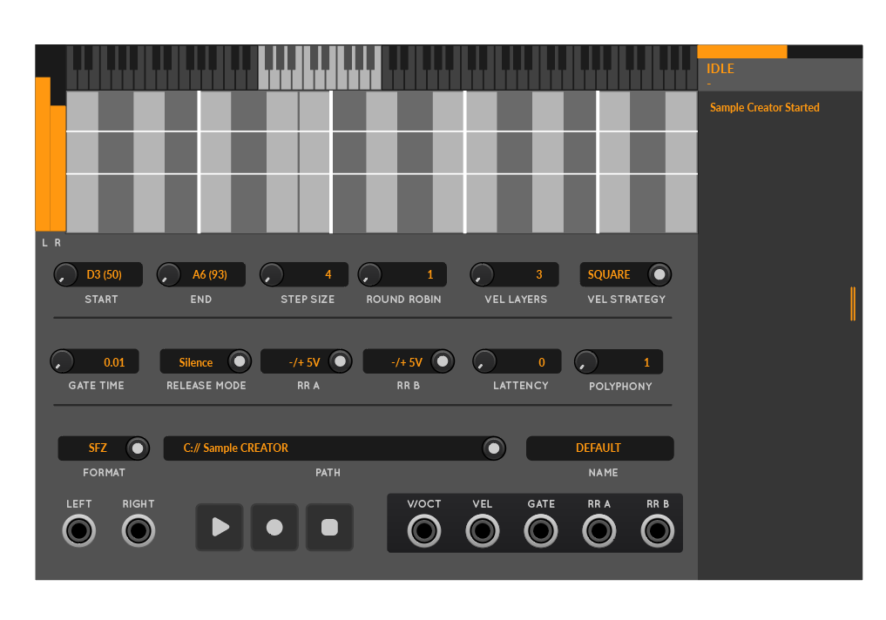

Nothing to see here. Getting closer though!

- Format Support
    - Do we want to store or write other sample metadata? Author? Patch?

- UI (wait for pyer to do much more)
    - Light skin doesn't suck (and is objeyed in step() in the Skin)
    - Scroll bar on the log would be nice eh
    - Range and Latency and so on controls freeze while rendering

- Engine / Rendering
    - Implement the loop modes not just silence and gate only modes
    - Implement polyphonic rendering
    - Different silence thresholds and keep the new 1e-6 as the default
    - Silent with 5s timeout mode
    - Make sure to include start and end notes in range and just divide top
      and bottom zones accordingly
    - Lower and Upper bound spans "whole keyboard"
    - Label Multisample as "bws/presonus" in the manual at least
    - a "Just the wrapper" mode where we create the wrapper but don't re-render the samples
      if sapmles with the file are there.

- Finishing Touches
    - Write a manual
    - Some code cleanup
        - Widget SC vs SampleCreator
        - Widget in CustomWidgets vs between that and module
        - Module - organize the code more clenaly, add a comment or two
        - Module state machine less of a spaghetti perhaps

- Future Things
    - Decent Sampler could have a UI and Effects by default?

Notes from pyer:

- I found a bit difficult to have a clear feeling of where the sampling range actually is on the keyboard especially for
  people not falimiar with the numbers for octaves or notes, so I added a first non dynamic view of the whole available
  range, with only the actual sampling range Enlighted.
- For the sampling range I’d use full heigth notes, also for black keys, so the sampling zones are defined between notes
- Then I tried to display all the elements in hierarchy with the sampling process: 1. the screen zone // 2. all the
  settings that interact with the screen zone // 3. the extra settings // 4. the file settings //5. Start the process
- A small detail, I renamed RR 1 and 2 as RR A and B, because it might be confusing, as some people could think the
  parameter RR 1 acts on the first Round robin, and RR2 on the second round robin.
- Right part is the status and log, it could be stretched if needed. I also added a status bar, which feels usefull to
  know when the sampling or testing process is completed.